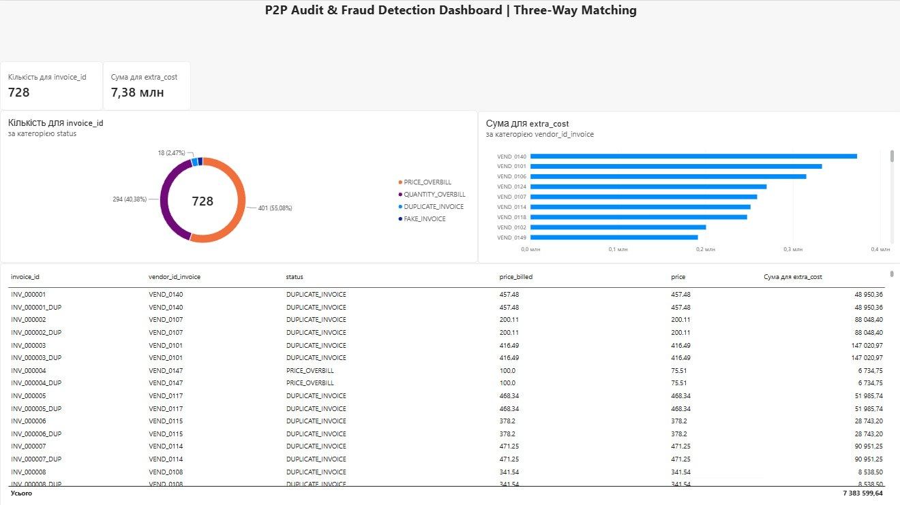

# Three-Way Matching Audit

Script that checks invoices against orders and warehouse receipts to find overpayments, fake bills, and errors.

## What It Checks

- **PRICE_OVERBILL:** The vendor charges a higher price than what was agreed in the order.
- **QUANTITY_OVERBILL:** The bill asks for payment for items that never arrived at the warehouse.
- **DUPLICATE_INVOICE:** The same bill sent twice to get paid double.
- **FAKE_INVOICE:** A bill with no real order behind it.

## Results

```text
AUDIT REPORT
Total Invoices Analyzed: 10,025
Exceptions Found:        728
Blocked Overbill Amount: $7,383,599.64
Breakdown by Issue:
DUPLICATE_INVOICE: 18 items | $1,087,090.74
FAKE_INVOICE: 15 items | $129,279.47
PRICE_OVERBILL: 401 items | $5,772,801.30
QUANTITY_OVERBILL: 294 items | $394,428.13
File saved: audit_exceptions_p2p.csv
```

## How to Run

```bash
# 1. Setup virtual environment and dependencies
python3 -m venv .venv
source .venv/bin/activate
pip install -r requirements.txt

# 2. Create sample data
python3 generate_data.py

# 3. Run audit check
python3 main.py
```

## Output

- `audit_exceptions_p2p.csv` — file with all found errors and suspicious transactions.
- Summary printed directly in the terminal.

## Power BI Dashboard

Interactive dashboard for fraud and exception tracking:


